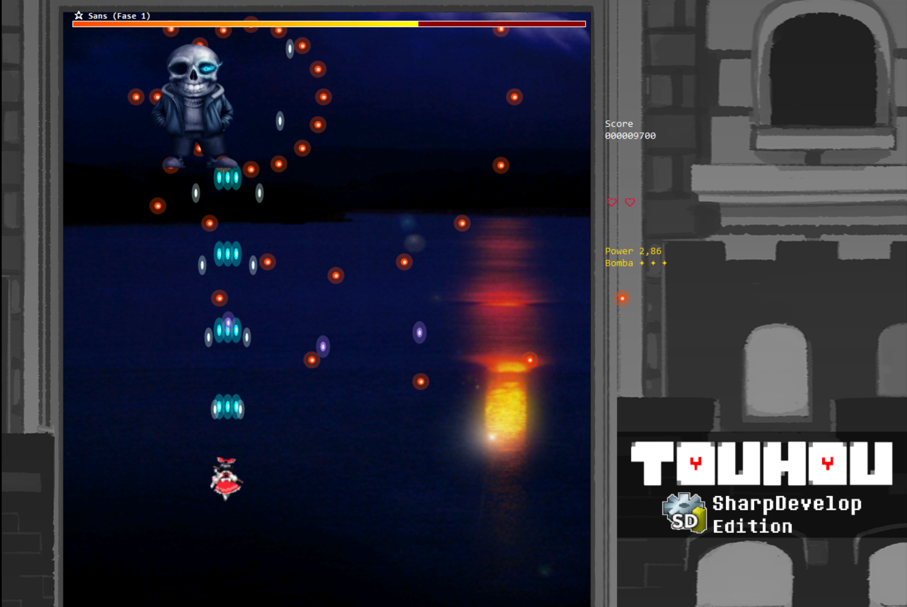

## Touhou: Sans Battle (A ShapDevelop School Project)

## Technical Details
- Built with C# and Windows Forms
- Implements bullet-hell collision detection
- Asset-based sprite animation system

## What's Implemented
- Reimplementation of Touhou 12's danmaku (bullet pattern) system
- Player dodge mechanics with invulnerability frames
- Boss AI with pattern-based attacks
- Score/health tracking system

## Build & Run

### From Source (SharpDevelop)
1. Install SharpDevelop
2. Open `TouhouSansBattle_SharpDev.sln`
3. Press F5 to compile and run
4. The executable will be in `bin/debug/`

### From Release Build
1. Download `Touhou_SansBattle_v1.0.0.rar` from [Releases](https://github.com/davpoggers/Touhou_SansBattle_Game_SharpDev/releases/tag/v1.0.0))
2. Extract and run `TouhouSansBattle_SharpDev.exe`

## Note on Code
Code comments are in Portuguese (PT-BR) as this was a school project. The functionality is well-commented but in Portuguese.

## Limitations
- Built with older SharpDevelop IDE (no modern framework upgrades)
- Limited performance optimization due to school project scope
- Windows-only (Windows Forms dependency)

Touhou and Undertale are not my property. For educational use only.
